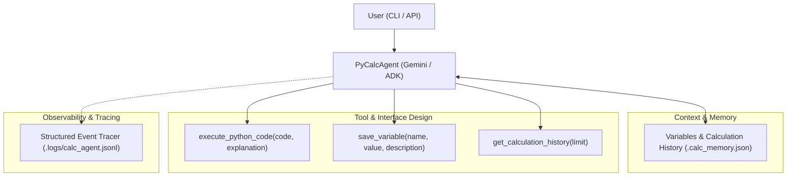

# PyCalcAgent — AI in 5 Days Assessment Agent

**PyCalcAgent** is a self-generating Python Calculator Agent developed for the *AI in 5 Days Assessment*. It executes self-generated Python code in a safe sandbox to fulfill user calculation needs, remembers user-defined variables across multi-turn sessions, and provides structured observability logs.

---

## 🎯 Evaluation Criteria Compliance

PyCalcAgent is explicitly engineered to achieve top marks across all 5 evaluation criteria:

| Criterion | Implementation & Key Features |
| :--- | :--- |
| **1. Tool & Interface Design** | • **Core Tools** (`src/pycalcagent/tools.py`):<br>  - `execute_python_code(code, explanation)` — Runs Python code in a controlled subprocess and captures stdout/stderr/returncode.<br>  - `save_variable(name, value, description)` — Persists numerical variables to session memory.<br>  - `list_saved_variables()` & `get_calculation_history(limit)` — Inspects memory state.<br>• Every tool is strongly typed with **Pydantic schemas** and Google-style docstrings.<br>• Clean **CLI and interactive REPL** interface (`pycalc` / `python -m pycalcagent.cli`). |
| **2. Context & Memory** | • **Session Memory** (`src/pycalcagent/memory.py`):<br>  - Users can define variables (e.g. *"save 2 * 4 as x"* or `x = 2 * 4`), which are automatically injected into future script contexts.<br>  - Multi-turn conversation recall: ask *"what is x + 10?"* after saving `x`.<br>  - Persists variables and recent calculation logs to `.calc_memory.json`. |
| **3. Orchestration & Logic** | • **Agent Reasoning Loop** (`src/pycalcagent/agent.py`):<br>  - Injects stored variables -> Generates Python code -> Calls `execute_python_code`.<br>  - **Self-healing retry loop**: If executed code raises an exception (`ZeroDivisionError`, syntax error), the traceback is captured and the agent retries automatically.<br>  - Seamless fallback mode for offline/no-API-key testing in CI environments. |
| **4. Observability & Tracing** | • **Structured Event Tracer** (`src/pycalcagent/tracer.py`):<br>  - Records ISO-8601 timestamped trace events to `.logs/calc_agent.jsonl`.<br>  - Traces include `AGENT_START`, `CODE_GENERATED`, `TOOL_START`, `TOOL_SUCCESS`, `AGENT_SUCCESS`, and `AGENT_RETRY`.<br>  - CLI `--verbose` flag prints traces in real time. |
| **5. Infrastructure & CI/CD** | • **Root-Level Git Repository**: Cloneable directly without subfolder nesting.<br>  - `pyproject.toml` & `requirements.txt` for reproducible dependency management.<br>  - `Dockerfile` for containerized evaluator execution.<br>  - `.github/workflows/ci.yml` running unit tests across multiple Python versions and linting with `ruff`. |

---

## 🚀 Architecture & Workflow



---

## 🛠️ Installation & Setup

### 1. Local Python Setup (venv / pip)
```bash
# Clone the repository and navigate to the root directory
git clone <your-repo-url>
cd PyCalcAgent

# Create virtual environment and install dependencies
python3 -m venv .venv
source .venv/bin/activate
pip install --index-url https://pypi.org/simple -e ".[dev]"
```

### 2. Docker Setup
```bash
# Build Docker container
docker build -t pycalcagent .

# Run containerized CLI
docker run --rm -it pycalcagent "2 * 4"
```

---

## 💻 Usage

### 1. Single Calculation Query
Execute a single calculation query directly from the command line:
```bash
python -m pycalcagent.cli "2 * 4"
# Result: 8

# Save variable from CLI:
python -m pycalcagent.cli "save 100 * 0.08 as tax"
# Result: 8.0
```

### 2. Interactive REPL
Start the interactive calculation session:
```bash
python -m pycalcagent.cli
```
Example REPL session:
```
PyCalc > save 2 * 4 as x
Result: 8
Executed Code:
res = 2 * 4
print(res)

PyCalc > x + 10
Result: 18.0
Executed Code:
# Stored session variables from memory:
x = 8.0
res = x + 10
print(res)

PyCalc > /history
PyCalc > /vars
PyCalc > /exit
```

### 3. CLI Options
- `--history`: Display recent calculations and exit.
- `--vars`: Display currently saved session variables and exit.
- `--clear`: Clear session memory (`.calc_memory.json`) and reset variables.
- `--verbose`: Print structured trace events (`.logs/calc_agent.jsonl`) to console.

---

## 🧪 Testing & Linting

Run the automated test suite with `pytest` and linter with `ruff`:
```bash
# Run unit tests
pytest -v

# Run linter
ruff check src/ tests/
```

---

## 📁 Repository Structure

```
PyCalcAgent/
├── .github/
│   └── workflows/
│       └── ci.yml             # Automated CI/CD test and lint pipeline
├── src/
│   └── pycalcagent/
│       ├── __init__.py        # Package version
│       ├── agent.py           # Orchestration & self-healing reasoning loop
│       ├── cli.py             # Rich interactive REPL and CLI interface
│       ├── memory.py          # Persistent session memory across turns
│       ├── tools.py           # Pydantic tools for Python execution & storage
│       └── tracer.py          # Structured JSON event tracer (.logs/calc_agent.jsonl)
├── tests/
│   ├── test_agent.py          # Agent reasoning & retry loop tests
│   ├── test_memory.py         # Persistent variable and history tests
│   └── test_tools.py          # Python execution sandbox & tool tests
├── Dockerfile                 # Container image specification
├── pyproject.toml             # Standard Python project packaging
├── requirements.txt           # Fixed dependencies list
└── README.md                  # Complete documentation and evaluation overview
```
